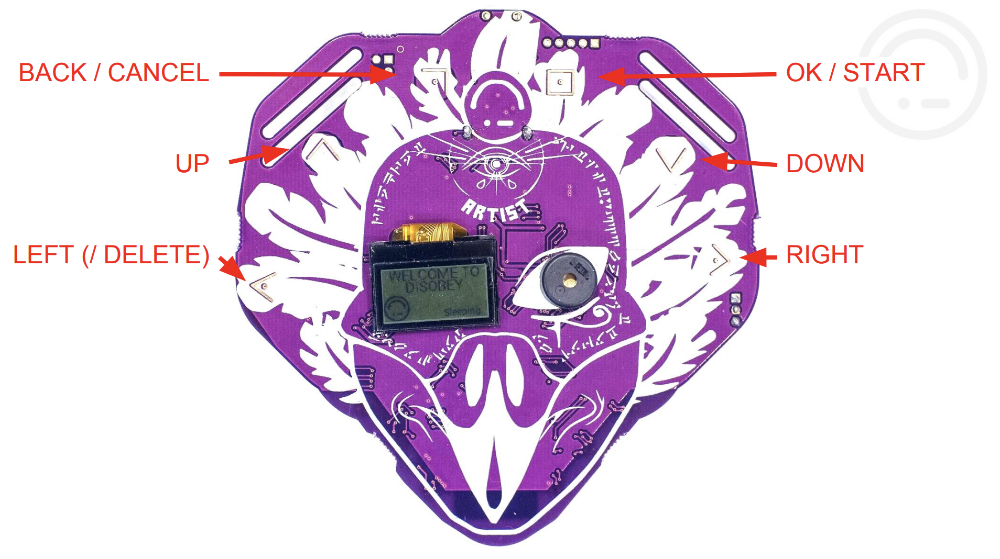
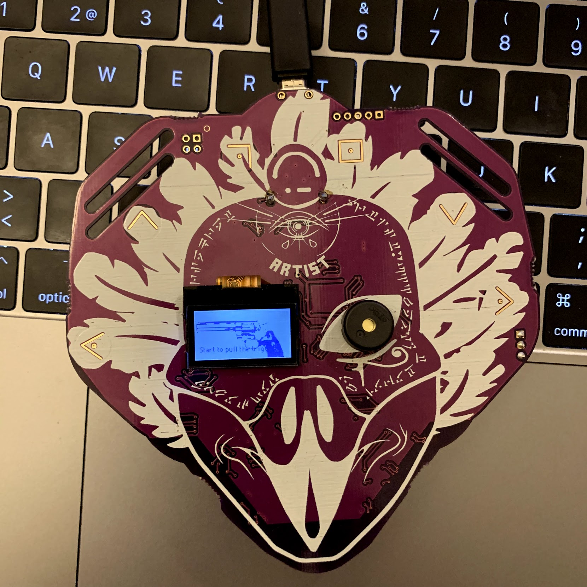

# Russian Roulette 9000

## What is this about?

It's about programming a microcontroller running micropython that was used as a badge at the  [Disobey](https://disobey.fi/) conference.

See documentation:

* <https://badge.disobey.fi/firmware/talk.pdf>
* <https://badge.disobey.fi/firmware/badge_API.txt>
* <https://wiki.badge.team/Disobey2019Badge/API>

Appstore: <https://badge.disobey.fi/projects/russian_roulette_9000>



### How to install?

Install via Wifi from the Appstore. See talk.pdf.

### How to develop?

Connect to the badge via USB:

```bash
screen -L /dev/tty.usbmodem1462201 115200
```

Use the micropython shell to iterate the code. See talk.pdf.

### What does it look like



Controls: Press start to shoot. New round is started automatically.
